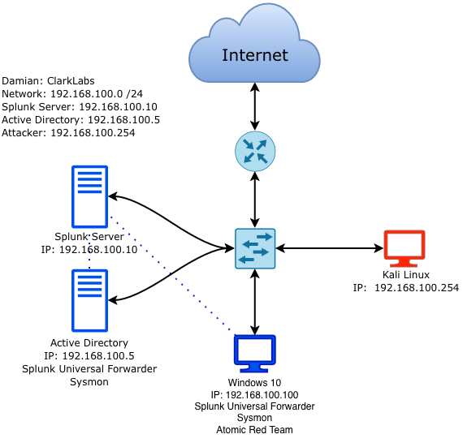

# Azure Active Directory Splunk Lab

I simulated an internal corporate network in Microsoft Azure demonstrating Active Directory, Splunk SIEM, identity and access management, and cloud infrastructure.

The lab models a company's internal network where a domain controller manages users and devices across a private network. All endpoints forward logs to a Splunk SIEM to monitor for unauthorized activity that could compromise the environment. Threat simulation was performed using Kali Linux and Atomic Red Team to validate detections end-to-end.

## Skills Demonstrated

| Capability | Evidence |
|---|---|
| Active Directory | [AD Setup](notes/setup-notes/ad-setup.md) — domain controller, OUs, users, domain join |
| SIEM & Log Management | [Splunk Setup](notes/setup-notes/splunk-setup.md) — Universal Forwarder, Windows Event Logs, Sysmon |
| Threat Detection | [Alert Rules](splunk-test-alerts/suspicious-activity-alerts.md) — brute force, account creation, suspicious processes |
| Cloud & Firewall | [Challenges](notes/challenges.md) — Azure NSG rules, port management, DNS troubleshooting |

## Repository Contents

- [`notes/setup-notes/`](notes/setup-notes/) — AD and Splunk setup documentation
- [`splunk-test-alerts/`](splunk-test-alerts/) — Splunk detection rules and alert configurations
- [`screenshots/`](screenshots/) — network topology diagram
- [`notes/`](notes/) — challenges encountered and lessons learned